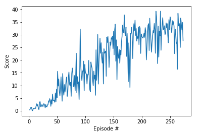

# Deep Reinforcement Learning Nanodegree - Project 2: Continuous Control

## Introduction
This project make use of the Unity environment, and creates a Deep Deterministic Policy Gradient (DDPG) agent to solve the problem implemented in Python 3 with PyTorch. Two options were proposed in the task, and the one with a single agent is selected, being this task episodic and the agent must get an average score of +30 over 100 consecutive episodes to pass it.

In this environment, a double-jointed arm can move to target locations. A reward of +0.1 is provided for each step that the agent's hand is in the goal location. Thus, the goal of your agent is to maintain its position at the target location for as many time steps as possible.

The observation space consists of 33 variables corresponding to position, rotation, velocity, and angular velocities of the arm. Each action is a vector with four numbers, corresponding to torque applicable to two joints. Every entry in the action vector should be a number between -1 and 1.

With respect to the training method, DDPG is chosen, which is a mode-free policy based learning algorith in which the agent learns directly from observation spaces without knowing the domain dynamic information. Moreover, it makes use of an actor-critic model in which the critic learns the value function like DQN and uses it to determine the change in the actor's policy based model.

Replay Buffer is used here to mitigate unstable learning, since it allows the agent to learn by gathering experiences collected from the environmen agents and sampling experiences from the buffer across a set of unrelated experiences.

The actor model is a Neural Network with two hidden layers (dimension of 400 and 300, respectively), and tanh is used in the final layer to take actions as output. The critic model is the same as the actor one, with the difference that the final layer is a fully connected one that maps states and actions to Q-values.

The hyperparameters of the model are:
- Learning rate = 0.001
- Gamma discount = 0.99
- Weight decay = 0
- Replay buffer size = 1000000
- Batch size = 1024
- Max time step per episode = 1000

## Results
The aiming of the project was to reach an average score of +30 over 100 consecutive episodes. It was reached after 273 episodes, as it can be seen in the folowwing Figure:

## Future Improvements
Although the objective proposed for the project has been achieved, this can be highly improved, and here some future improvements are proposed:

  -  More layers in the Neural Network
  -  Increase the batch size to have a more frequent update of the Nerwork
  -  Try other models such as Priority Experienced Replay.
